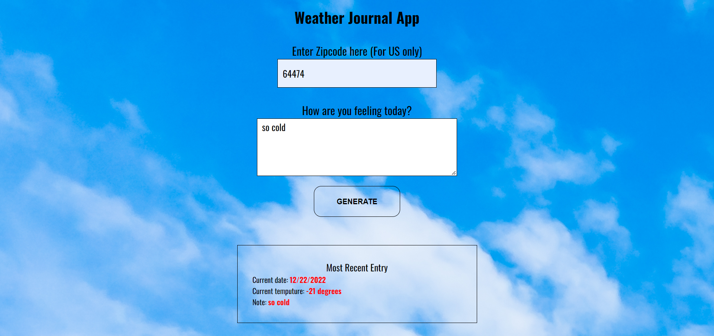

# Weather-Journal App Project

## Overview
This project implement an asynchronous concept that uses Web API and user data to dynamically update the UI. 

## How to run
* Open terminal from [weather-jounal-app](./) folder
* Run `npm install`
* Run `npm run start`
* Open browser and run port [8080](http://localhost:8080)

## Overview
Temp in Osborn, Missouri, US
